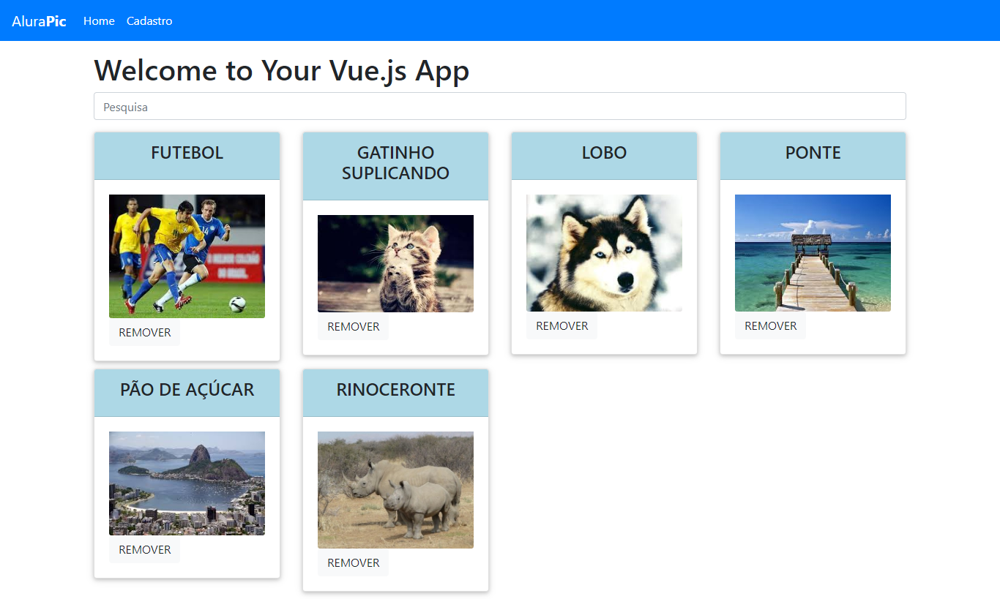

# Alurapic

Este projeto é um projeto vue.js criado apartir das aulas do curso de vue da alura

# Screenshot



## Desenvolvimento

### Api
A api foi disponibilizada pelo professor do curso e foi desenvolvido com express. Para iniciar a api:
``` bash
# install dependencies
npm install

# serve with hot reload at localhost:3030
npm start
```

### App
O app é a parte do frontend da aplicação e foi desenvolvida com vue.js e bootstrap. Para iniciar o app:
``` bash
# install dependencies
npm install

# serve with hot reload at localhost:8080
npm run start
```